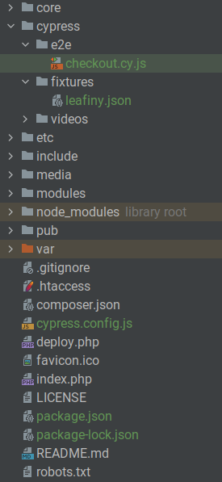

# Leafiny Cypress

Leafiny e2e tests. Tests will be added over time.

Tests are written on the Leafiny [sample data](https://github.com/leafiny/sample-data) with the default theme.

# Installation

First, install Cypress in the root of the Leafiny project:

```
npm install cypress --save-dev
```

Then, copy the files from the `sources` directory of this repository into the Leafiny root directory.



# Setup

Edit the `cypress.config.js` and update the Leafiny **baseUrl** value:

```javascript
const { defineConfig } = require("cypress");

module.exports = defineConfig({
  e2e: {
    "baseUrl": "https://localhost.leafiny/",
    "viewportWidth": 1280,
    "viewportHeight": 1080, 
    "supportFile": false
  },
});
```

# Running

```
npx cypress run
```

# Progress

| Spec file          | Test                                                              |
|--------------------|-------------------------------------------------------------------|
| `checkout.spec.js` | :heavy_check_mark: Add product to cart                            |
|                    | :heavy_check_mark: Update item quantity                           |
|                    | :black_square_button: Remove an item                              |
|                    | :heavy_check_mark: Check the free item cart rule                  |
|                    | :heavy_check_mark: Add a shipping address                         |
|                    | :black_square_button: Forgot to fill in an address required field |
|                    | :black_square_button: Add a different billing address             |
|                    | :black_square_button: Forgot to select a shipping method          |
|                    | :heavy_check_mark: Select shipping method                         |
|                    | :black_square_button: Forgot to select a payment method           |
|                    | :heavy_check_mark: Select payment method                          |
|                    | :heavy_check_mark: Add a valid coupon                             |
|                    | :black_square_button: Add a fake coupon                           |
|                    | :black_square_button: Forgot to accept general conditions of sale |
|                    | :heavy_check_mark: Place Order                                    |
|                    | :black_square_button: Ordered product is out of stock             |